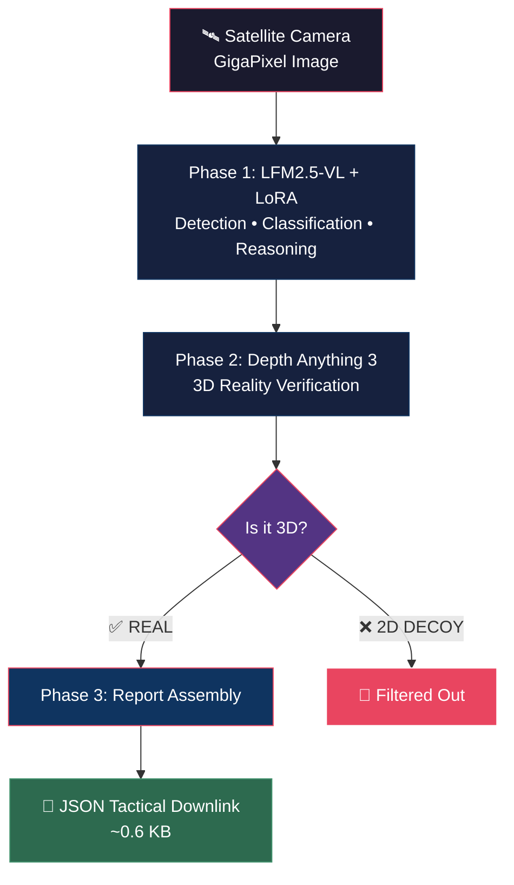

<p align="center">
  
  
  
</p>

<h1 align="center">🛰️ Project ARGUS</h1>
<h3 align="center">Autonomous Reconnaissance & Ground Understanding System</h3>

<p align="center">
  <em>Edge-compute AI pipeline that runs in orbit — detects, classifies, and reasons about military targets from satellite imagery, then downlinks a tiny JSON tactical report instead of raw gigabytes.</em>
</p>

<p align="center">
  <a href="https://huggingface.co/johnny711/argus-lfm-lora">
    
  </a>
  
  
  
  
</p>

---

## 🎯 The Problem

Military reconnaissance satellites capture **massive, gigapixel images** — but satellites have extremely limited downlink bandwidth. Beaming raw imagery to Earth takes hours. And after all that waiting, the "tank" you spotted might just be a **$500 inflatable decoy**.

**The cost of this inefficiency?**
- ⏱️ Hours of latency for time-critical intelligence  
- 📡 Saturated downlink channels blocking other payloads  
- 🎈 False positives from 2D decoys wasting analyst time

## 💡 Our Solution

> **Move the intelligence to the edge — run AI directly in orbit.**

ARGUS processes satellite imagery **locally on the satellite**, filters out 2D decoys, and downlinks an ultra-lightweight **JSON tactical report** to ground commanders in real-time.

| Metric | Traditional Pipeline | **ARGUS** |
|--------|---------------------|-----------|
| Downlink size | ~19 GB (raw imagery) | **~0.6 KB** (JSON report) |
| Compression ratio | 1:1 | **29,789x** |
| Bandwidth saved | 0% | **99.97%** |
| Models required | 4–5 (YOLO + SAM + ...) | **2** (VLM + Depth) |
| Latency | Hours | **Seconds** |

---

## 🏗️ Architecture — LFM-First Pipeline



| Phase | Model | What it Does | Output |
|:-----:|-------|-------------|--------|
| **1** | [LFM2.5-VL-450M](https://huggingface.co/LiquidAI/LFM2.5-VL-450M) + [LoRA](https://huggingface.co/johnny711/argus-lfm-lora) | Unified detection, localization, classification & tactical reasoning | JSON array of targets |
| **2** | [Depth Anything 3](https://github.com/ByteDance-Seed/depth-anything-3) | 3D reality check — is the target physically real or a flat decoy? | REAL / DECOY verdict |
| **3** | — | Report assembly & compression metrics | Tactical JSON |

### Why LFM-First?

Traditional satellite intel pipelines chain **4–5 separate models** (YOLO → SAM → Classifier → Depth → Reasoner). ARGUS puts Liquid AI's LFM2.5-VL at the center — a single 450M-parameter vision-language model that performs **detection, bounding-box localization, AND tactical reasoning** in one inference pass.

<table>
<tr><td>✅ <strong>Reduced VRAM</strong></td><td>From 4 GPU-loaded models to just 2</td></tr>
<tr><td>✅ <strong>Open Vocabulary</strong></td><td>Prompted with "find military vehicles" — not locked to DOTA class IDs</td></tr>
<tr><td>✅ <strong>Edge Deployable</strong></td><td>Runs on Jetson Orin, mobile, even WebGPU</td></tr>
<tr><td>✅ <strong>10.4 MB Adapter</strong></td><td>Fine-tuned LoRA — not a full model copy</td></tr>
</table>

---

## 🚀 Quick Start

### Prerequisites

- Python 3.10+
- CUDA-capable GPU *(recommended)*
- [Docker](https://docs.docker.com/get-docker/) *(for SimSat satellite simulator)*
- [Mapbox Account](https://www.mapbox.com/) *(free tier — provides satellite imagery)*

### 1. Clone & Install

```bash
git clone https://github.com/jatin711-debug/Project-ARGUS.git
cd Project-ARGUS

# Install Python dependencies
pip install -r requirements.txt

# Install Depth Anything 3 (vendored)
pip install -e ./Depth-Anything-3

# Install PEFT for LoRA adapter loading
pip install peft
```

### 2. Download Fine-Tuned Model

```bash
# Download the ARGUS LoRA adapter (10.4 MB)
hf download johnny711/argus-lfm-lora --local-dir weights/argus-lfm-lora
```

### 3. Configure

```bash
cp .env.example .env
# Edit .env — add your Mapbox token
```

> **📌 Mapbox Token:** Get a free token at [mapbox.com](https://www.mapbox.com/) and add it to `.env` as `MAPBOX_ACCESS_TOKEN`. SimSat uses this to serve real satellite imagery.

### 4. Start SimSat (Satellite Simulator)

```bash
# In a separate terminal — provides the satellite imagery API
MAPBOX_ACCESS_TOKEN=pk.your_token_here docker compose up
```

### 5. Run ARGUS

```bash
python -m argus
```

You should see:
```
2026-04-26 13:37:42 | INFO | argus.pipeline | Initiating orbital scan …
2026-04-26 13:37:42 | INFO | argus.pipeline | Satellite at: [-83.53, 66.50, 800.78]
2026-04-26 13:37:45 | INFO | argus.pipeline | Image acquired (2560x2560) — entering pipeline.
2026-04-26 13:37:45 | INFO | argus.phases.detection | Phase 1: VLM target detection …
2026-04-26 13:37:52 | INFO | argus.phases.detection |   3 target(s) of interest
2026-04-26 13:37:53 | INFO | argus.phases.depth | Phase 2: Depth analysis …
2026-04-26 13:37:54 | INFO | argus.pipeline | Filtered 1 flat decoy(s)
2026-04-26 13:37:54 | INFO | argus.pipeline | TACTICAL REPORT: 2 confirmed targets
```

---

## ⚙️ Configuration

All settings are loaded from environment variables (`.env` file):

| Variable | Default | Description |
|:---------|:--------|:------------|
| `MAPBOX_ACCESS_TOKEN` | — | Mapbox API token for satellite imagery |
| `ARGUS_VLM_MODEL` | `LiquidAI/LFM2.5-VL-450M` | Base VLM model ID |
| `ARGUS_VLM_ADAPTER` | `weights/argus-lfm-lora` | Path to LoRA adapter |
| `ARGUS_VLM_MAX_TOKENS` | `512` | Max tokens for VLM generation |
| `ARGUS_DA3_MODEL` | `depth-anything/DA3-BASE` | Depth model ID |
| `ARGUS_DEPTH_THRESH` | `0.1` | Depth std threshold (below = flat decoy) |
| `ARGUS_GHOST_STD` | `10.0` | Pixel std threshold for ghost/blank images |
| `ARGUS_SCAN_INTERVAL` | `1` | Seconds between scans (`0` = single shot) |

---

## 📊 Fine-Tuning Details

The LoRA adapter was trained to teach LFM2.5-VL to output **structured military detection JSON** from satellite imagery.

| Parameter | Value |
|:----------|:------|
| **Base Model** | [LiquidAI/LFM2.5-VL-450M](https://huggingface.co/LiquidAI/LFM2.5-VL-450M) |
| **Method** | QLoRA (4-bit) via [Unsloth](https://github.com/unslothai/unsloth) |
| **LoRA Config** | r=16, alpha=32, all linear layers |
| **Trainable Params** | 1,376,256 / 450,095,104 **(0.31%)** |
| **Datasets** | [MVRSD](https://github.com/baidongls/MVRSD) + [DOTA](https://huggingface.co/datasets/HichTala/dota) |
| **Training Samples** | 3,512 (military vehicles, aircraft, naval vessels) |
| **Epochs** | 3 (1,317 steps) |
| **Final Loss** | **0.4017** |
| **Hardware** | NVIDIA T4 GPU |
| **Training Time** | ~60 minutes |
| **Adapter Size** | **10.4 MB** |

### Detected Classes

| Category | Classes | Threat Level |
|:---------|:--------|:------------:|
| 🚗 Ground Vehicles | Small/Large Military Vehicle, AFV, Construction Vehicle | LOW–HIGH |
| ✈️ Aerial Assets | Military Aircraft, Helicopter | HIGH |
| 🚢 Naval | Naval Vessel, Harbor Installation | HIGH |
| 🏗️ Infrastructure | Bridge, Storage Tank, Port Crane, Helipad, Airfield | MEDIUM |

### Train Your Own

The fine-tuning script is included. Run it on Google Colab or [Modal](https://modal.com):

```bash
# Open in Colab and run cell-by-cell
# Or run directly:
python finetune_lfm_argus.py
```

---

## 📋 Example Tactical Report

This is what gets downlinked — **0.6 KB** instead of 19 GB of raw imagery:

```json
{
  "mission": "PROJECT ARGUS",
  "timestamp": "2026-04-26T13:37:54Z",
  "satellite_position": {
    "lon": 35.9284,
    "lat": 34.8021,
    "alt_km": 793.1
  },
  "image_resolution": "2560x2560",
  "targets_detected": 3,
  "decoys_filtered": 1,
  "confirmed_targets": [
    {
      "id": 1,
      "label": "Large Military Vehicle",
      "bbox": [0.3125, 0.4531, 0.3867, 0.5195],
      "confidence": 0.91,
      "threat_level": "HIGH",
      "reasoning": "Large Military Vehicle detected in convoy formation, indicates active movement",
      "depth_verdict": "REAL"
    },
    {
      "id": 2,
      "label": "Military Aircraft",
      "bbox": [0.7031, 0.1289, 0.7812, 0.1953],
      "confidence": 0.88,
      "threat_level": "HIGH",
      "reasoning": "Military Aircraft spotted near airstrip perimeter, possible base security",
      "depth_verdict": "REAL"
    }
  ],
  "filtered_decoys": [
    {
      "label": "Armored Fighting Vehicle",
      "confidence": 0.72,
      "depth_verdict": "2D_DECOY",
      "reasoning": "Flat depth profile — likely inflatable or painted decoy"
    }
  ],
  "edge_compute_savings": {
    "raw_image_kb": 19200,
    "report_kb": 0.64,
    "compression_ratio": "29,789x",
    "bandwidth_saved_pct": 99.97
  }
}
```

---

## 📁 Project Structure

```
Project-ARGUS/
├── argus/                          # Core pipeline package
│   ├── __init__.py
│   ├── __main__.py                 # Entry point — orbital scan loop
│   ├── config.py                   # Centralized settings + logger
│   ├── loader.py                   # Model registry (VLM + DA3 + LoRA)
│   ├── models.py                   # Target & DepthAnalysis dataclasses
│   ├── pipeline.py                 # 3-phase orchestrator
│   ├── satellite.py                # SimSat API client
│   ├── report.py                   # JSON tactical report builder
│   └── phases/
│       ├── detection.py            # Phase 1 — LFM2.5-VL detection
│       └── depth.py                # Phase 2 — DA3 depth verification
│
├── weights/
│   └── argus-lfm-lora/             # Fine-tuned LoRA adapter (10.4 MB)
│       ├── adapter_config.json
│       ├── adapter_model.safetensors
│       └── ...
│
├── finetune_lfm_argus.py           # Fine-tuning script (Colab/Modal)
├── steer_simsat.py                 # SimSat orbit steering utility
├── requirements.txt
├── .env.example
└── README.md
```

---

## 🔗 Resources & Links

| Resource | Link |
|:---------|:-----|
| 🤗 Fine-Tuned Adapter | [johnny711/argus-lfm-lora](https://huggingface.co/johnny711/argus-lfm-lora) |
| 🧠 Base Model | [LiquidAI/LFM2.5-VL-450M](https://huggingface.co/LiquidAI/LFM2.5-VL-450M) |
| 📡 SimSat Simulator | [DPhi-Space/SimSat](https://github.com/DPhi-Space/SimSat) |
| 🏆 Hackathon | [Liquid AI x DPhi Space](https://luma.com/n9cw58h0?tk=nVwuXw) |
| 🔬 Depth Anything 3 | [ByteDance-Seed/depth-anything-3](https://github.com/ByteDance-Seed/depth-anything-3) |
| ⚡ Unsloth | [unslothai/unsloth](https://github.com/unslothai/unsloth) |
| 🗺️ Mapbox | [mapbox.com](https://www.mapbox.com/) |

---

## 🧪 Tech Stack

<p align="center">
  
  
  
  
  
  
</p>

---

## 📄 License

This project is licensed under the [Apache License 2.0](LICENSE).

---

<p align="center">
  <strong>Built with 🔥 for the Liquid AI x DPhi Space "AI in Space" Hackathon</strong><br/>
  <em>Moving intelligence to the edge — because bandwidth is the bottleneck, not compute.</em>
</p>
